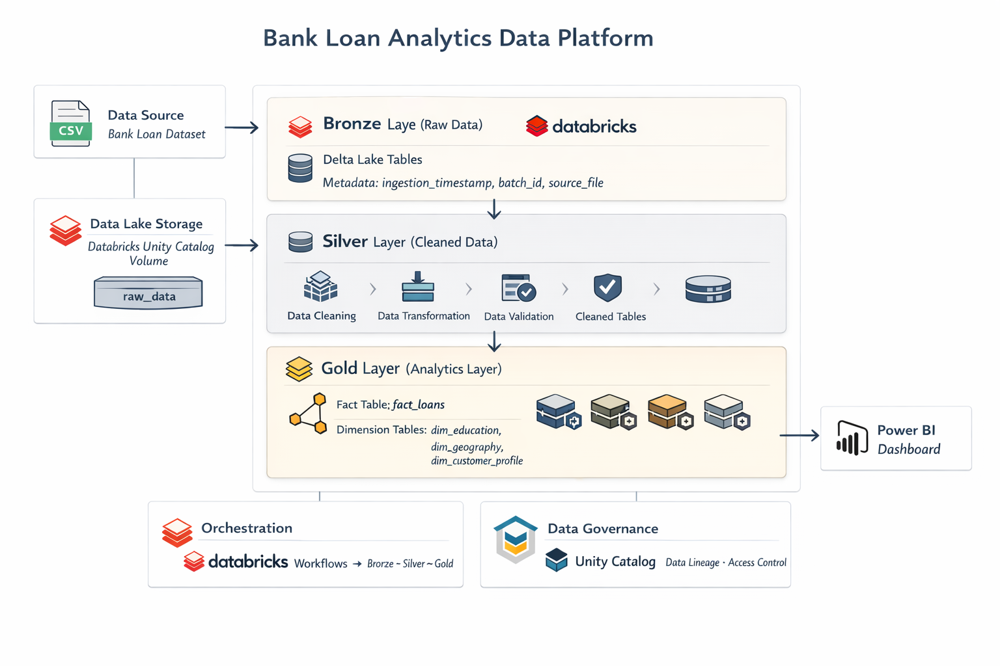
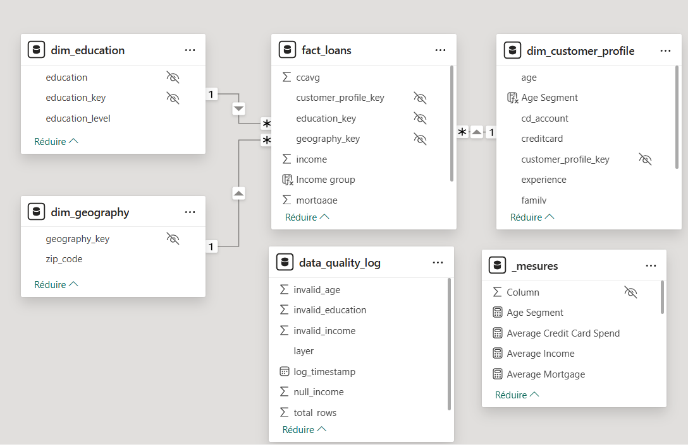
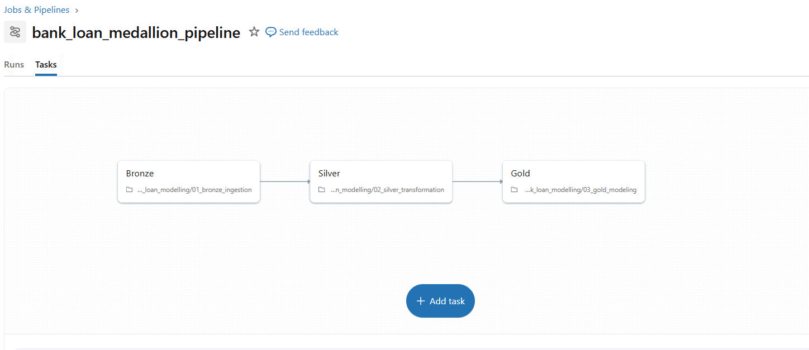
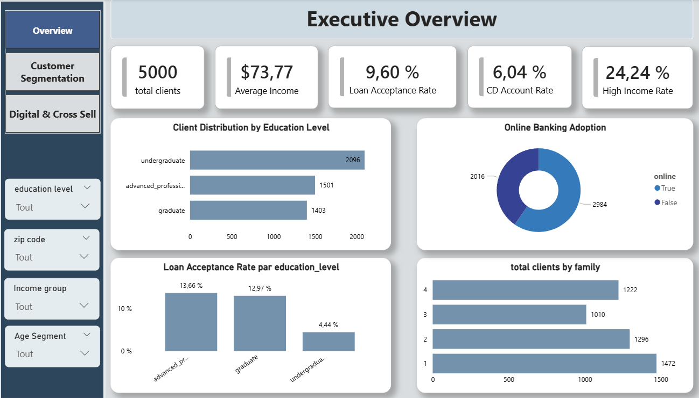
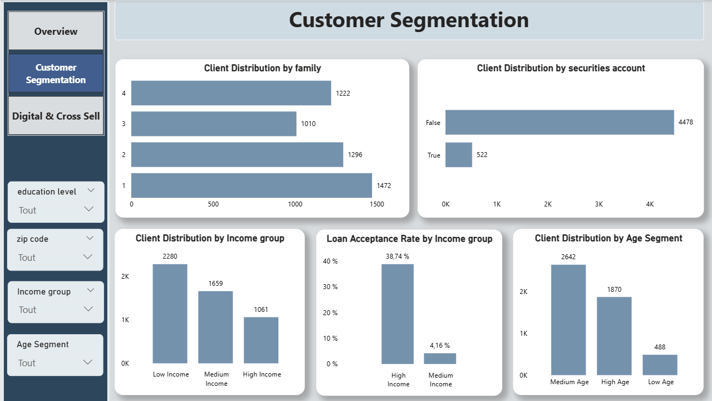
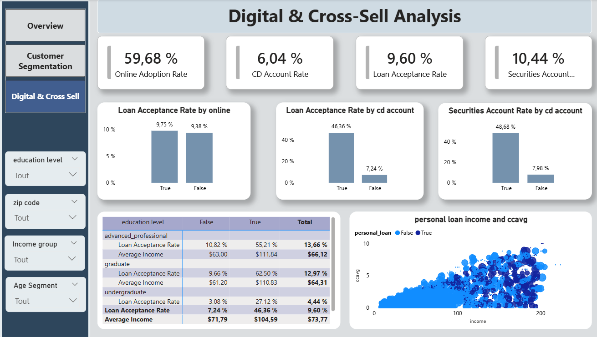

# 📊 Bank Loan Analytics Pipeline
**Databricks • Unity Catalog • Medallion Architecture • Power BI**

📌 Contexte du projet

Dans le secteur bancaire, l’analyse des données clients est essentielle pour améliorer les stratégies **de marketing, de vente de produits financiers et de gestion de la relation client**.

Les institutions financières cherchent notamment à répondre à plusieurs questions clés :

- Quels profils de clients sont les plus susceptibles d’accepter une offre de prêt ?
- Quel est l’impact de l’adoption des services digitaux sur les décisions financières ?
- Quels segments de clients représentent les meilleures opportunités de cross-selling ?

Pour répondre à ces problématiques, ce projet met en place une plateforme analytique complète allant de l’ingestion des données jusqu’à la visualisation des indicateurs métiers.

L’objectif est de construire un **pipeline de données moderne** permettant de transformer des données brutes en informations exploitables pour la prise de décision.

---

# 🏗️ Architecture du projet

Ce projet implémente une architecture Medallion (Bronze / Silver / Gold) sur Databricks.

Elle permet de structurer les données en plusieurs niveaux de qualité

## Architecture

Cette architecture garantit la traçabilité des données, la qualité des transformations, la séparation des responsabilités
et la performance des analyses.

---

# ⚙️ Technologies utilisées

- Databricks
- Unity Catalog
- PySpark
- Delta Lake
- Power BI
- Architecture Medallion
- Star Schema (modèle dimensionnel)

---

# 📂 Dataset

Le projet utilise le dataset : **Bank Loan Modelling**

Il contient des informations sur les clients d'une banque :

- âge
- revenu
- dépenses carte bancaire
- utilisation des services digitaux
- comptes financiers
- acceptation d’une offre de prêt
Ces données permettent d’analyser :
- le comportement client
- l’adoption des produits financiers
- les opportunités de cross-sell.

---

# 🥉 Bronze Layer — Ingestion des données

La couche **Bronze** correspond à l’ingestion brute des données.

Objectifs :

conserver les données sources sans transformation
assurer la traçabilité
stocker les fichiers en format Delta

Les données sont importées depuis un fichier CSV stocké dans un Volume Unity Catalog.

**Actions réalisées**

- lecture du fichier source
- normalisation des noms de colonnes
- ajout de métadonnées d’ingestion :
   - timestamp
   - source file
   - batch id

bronze.bank_loan_raw

---

# 🥈 Silver Layer — Transformation et qualité des données

La couche Silver contient des données nettoyées et structurées.

Objectifs :

- appliquer un typage strict
- corriger les formats de données
- supprimer les anomalies
- préparer les données pour l’analyse

**Transformations réalisées**

- conversion des types numériques
- correction du séparateur décimal
- conversion des variables binaires en boolean
- normalisation des niveaux d’éducation
- suppression des colonnes techniques inutiles

# 🔎 Data Quality Checks

Des contrôles de qualité ont été ajoutés pour garantir la fiabilité des données :

Exemples :

- Age ≥ 18
- Income > 0
- Education ∈ {1,2,3}
- valeurs nulles interdites sur certaines colonnes

Les métriques de qualité sont enregistrées dans une table de monitoring.

gold.data_quality_log

Cette table permet de suivre l’évolution de la qualité des données dans le temps.

# 🥇 Gold Layer — Modèle analytique

La couche Gold expose les données sous forme d’un modèle dimensionnel optimisé pour la BI.

Un schéma en étoile (Star Schema) a été implémenté.

**Dimensions**

dim_education
dim_geography
dim_customer_profile

**Table de faits**

fact_loans

Cette table contient :

- income
- credit card spending
- mortgage
- loan acceptance

Les dimensions permettent de segmenter les analyses par :

- niveau d’éducation
- zone géographique
- profil client.

----

# 🔄 Orchestration du pipeline

Le pipeline complet est orchestré via Databricks Jobs.

Workflow :

Task 1 → Bronze ingestion
Task 2 → Silver transformation
Task 3 → Gold modeling

Chaque étape dépend de la précédente.

Si une étape échoue, les suivantes ne s’exécutent pas.

Cela garantit la cohérence des données.

---

# 📊 Visualisation avec Power BI

Les tables Gold sont utilisées comme source pour un dashboard Power BI.

Le rapport est structuré en trois pages analytiques.

### 📈 Dashboard — Executive Overview

Cette page offre une vue synthétique de l’activité.

Indicateurs principaux :

- nombre total de clients
- revenu moyen
- taux d’acceptation des prêts
- adoption des services digitaux

### 👥 Dashboard — Customer Segmentation

Cette page analyse les profils clients.

Analyses réalisées :

- segmentation par âge
- segmentation par revenu
- distribution familiale
- adoption des produits financiers

### 💻 Dashboard — Digital & Cross-Sell Analysis

Cette page étudie l’impact du digital sur l’acceptation des produits financiers.

Exemples d’analyses :

- adoption du banking online
- impact des comptes CD
- corrélation revenu / dépenses carte bancaire
- opportunités de cross-sell

---

# 🚀 Résultats du projet

Ce projet démontre la mise en place d’un pipeline de données complet :

- ✔ ingestion des données
- ✔ transformation et validation
- ✔ modélisation analytique
- ✔ visualisation décisionnelle

Il met en œuvre des bonnes pratiques de Data Engineering et Business Intelligence :

- architecture Medallion
- gouvernance avec Unity Catalog
- modèle dimensionnel
- contrôle de qualité des données
- pipeline orchestré

# 📚 Perspectives d'amélioration

Plusieurs évolutions pourraient être ajoutées :

- implémentation de Row Level Security
- mise en place d’un CI/CD pour les pipelines
- ajout d’un catalogue de données
- intégration d’un modèle de Machine Learning
